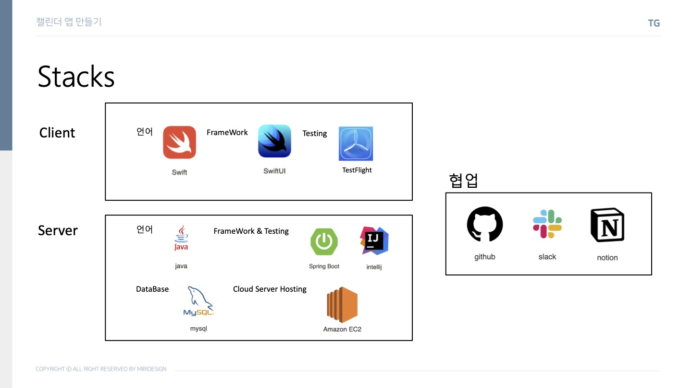
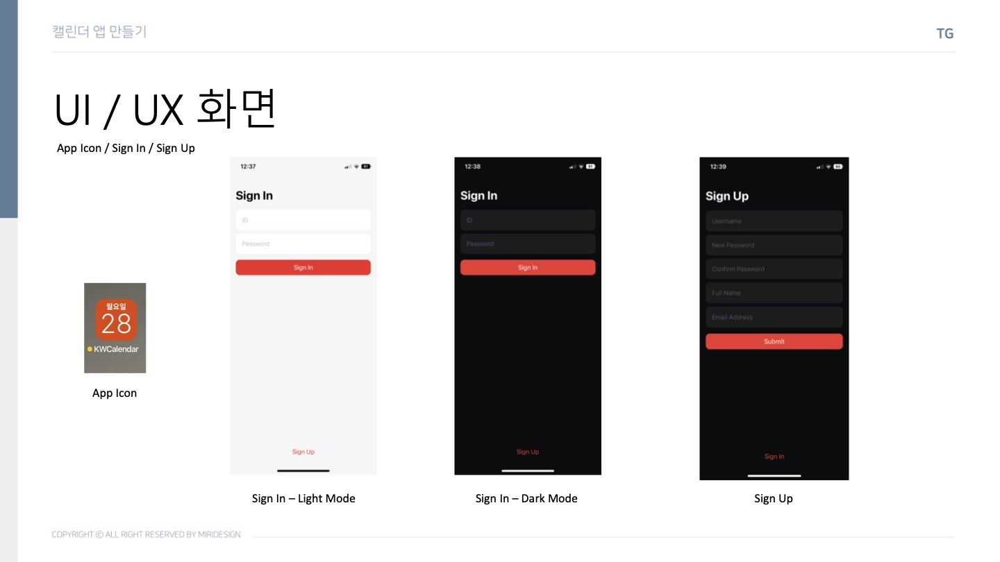
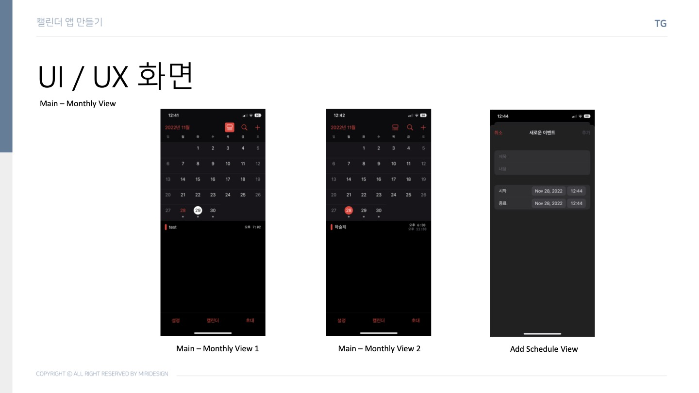
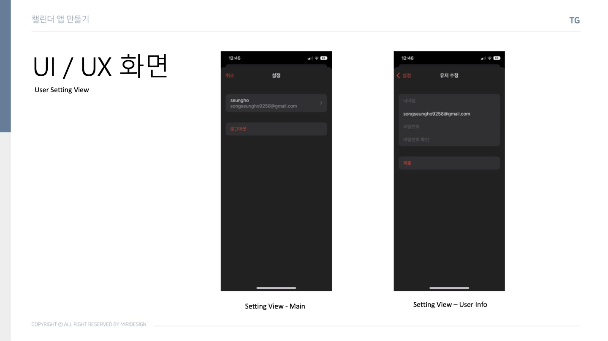

# TG Calendar - Client
## 2022 광운대학교 소프트웨어학부 학술소모임 <Triple G> 스터디 활동:
Spring-Boot 스터디와 iOS 스터디의 연합 프로젝트 : iOS 기본 캘린더 앱 UI & Basic Features 구현

## Stacks

## UI / UX
### 사용자 로그인, 회원가입

### Monthly Calendar

### 사용자 정보 설정

